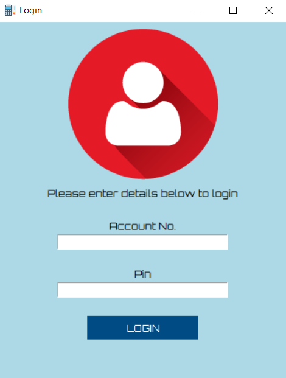
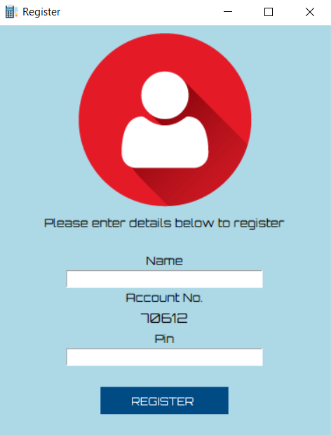
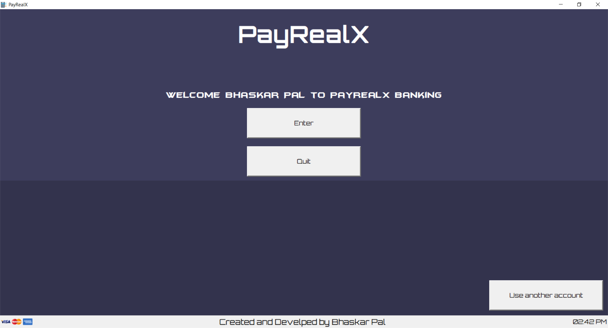
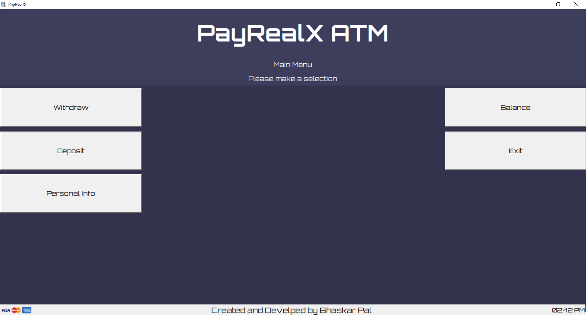
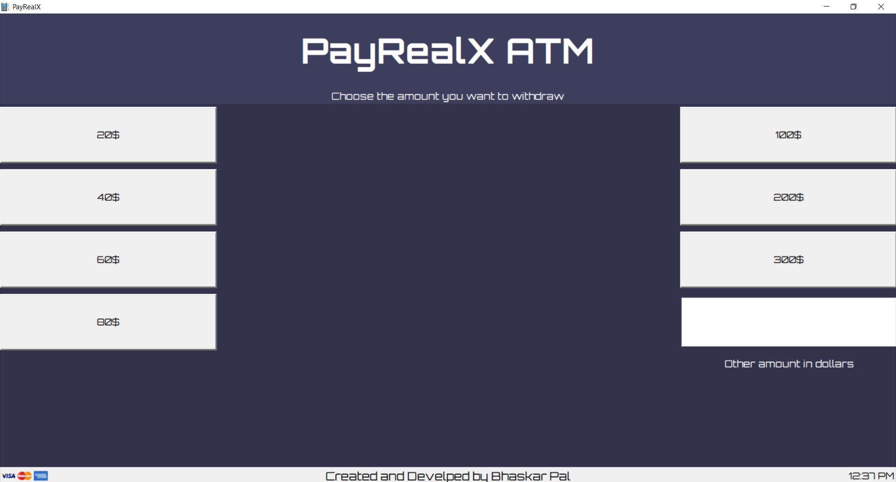

# tkinter-ATM

ATM GUI with mysql database coded with tkinter python

This allows the user the register and login to access the ATM where the user can deposit,withdraw and check his balance
The data of every user and will be stored in the Mysql database

## Register/login screen

## ATM Snapshots

## Requirements

* Python 3.X
* Pillow should be insatlled on your system (pip install Pillow)
* Mysql should be installed on your system

## How to run the program

* Place the python file in the image folder and run the program

## Mysql Database

* Database : payrealx
* Table    : payrealbank

## Note

* for the program to run successfully open the code and change `enter your mysql password` to the password of your mysql system password

## Build with
* Python

## Author
* Bhaskar Pal - *Initial Work* - [bhaskarpal](https://github.com/onyx-storm) 

## License
* This project is licensed under the MIT License - see the [LICENSE.md](LICENSE) file for details

## Acknowledgments
* Base code created by the help of [CodeFoxx](https://www.youtube.com/channel/UCvi0rWTSkJkrunfhXH0tYuA) Youtuber

