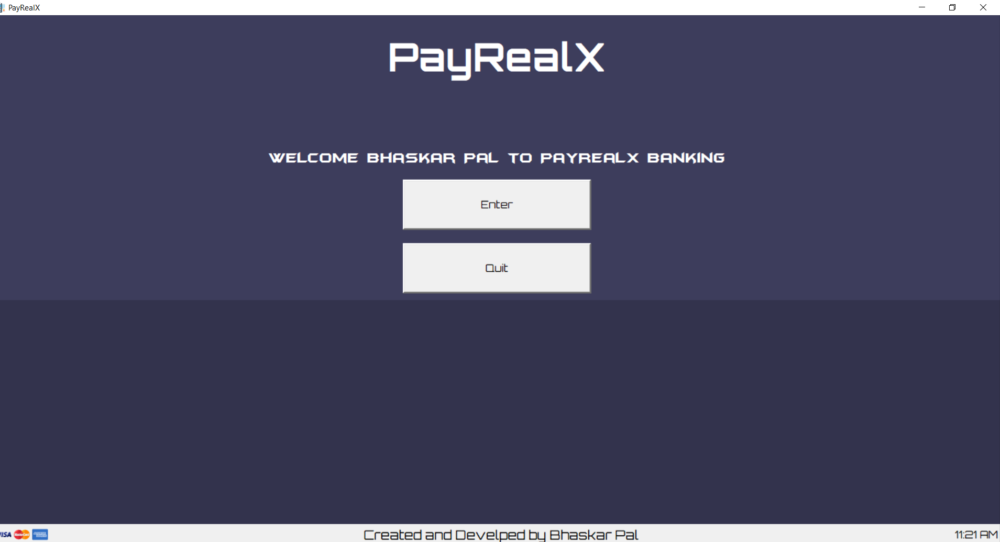

# tkinter-ATM
ATM GUI with mysql database coded with tkinter python

This allows the user the register and login to access the ATM where the user can deposit,withdraw and check his balance
A database will be created of every user and will be stored in the Mysql

## Register/login screen

## ATM Screen

## Requirements

* Python 2.X or 3.X
* Pillow should be insatlled in your system (pip install Pillow)
* Mysql should be installed in your system

## How to run the program

* Download all the images folder and the python file in the same folder and run the program

## Note

* for the program to run successfully open the code and change `enter your mysql password` to the password of your mysql system password

## Build with
* Python

## License
* This project is licensed under the MIT License - see the [LICENSE.md](LICENSE.md) file for details

## Acknowledgments
* Base code created by the help of [CodeFoxx](https://www.youtube.com/channel/UCvi0rWTSkJkrunfhXH0tYuA) Youtuber
